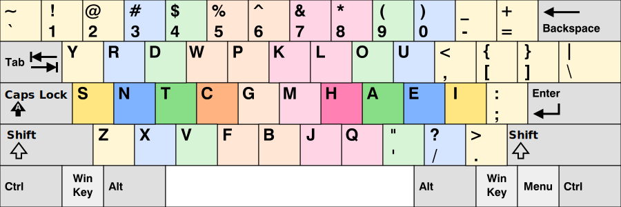
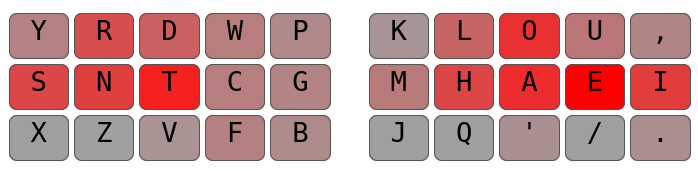

# Pine Layout

This is an alternative keyboard layout I created while testing my layout analyzer program:



## Heatmap

Common letters are placed in easily accessible locations, lowering the amount of effort required. Additionally, bottom row use is decreased significantly from other layouts, in order to avoid row jumps and create comfortable rolls



## Analysis

Pine is primarily optimized for low sfb and dsfb use; however, it scores very well in other metrics as well.
It focuses more on rolling rather than alternation, while also keeping onehands and redirects to a minimum. Index and center column use is also fairly low as well. Pine ranks among the top layouts when these metrics are considered.

Below are the results from a powerful analyzer made by [Semi](https://github.com/semilin):

```
Rolls: ~53.23%
Alternates: ~33.38%
Onehands: ~1.48%
Redirects: ~5.48%
Finger Speed (weighted): 0.36
Finger Speed (unweighted): 5.58
Highest Speed (weighted): 0.10 (RP)
Highest Speed (unweighted): 1.23 (RI)
Index Usage: 9.4% 11%
Center Column Usage: 4.1% 3%
SFBs: 0.606%
DSFBs: 6.307%
Top SFBs:
	rn 0.133%	ys 0.122%	ue 0.089%	lk 0.049%
	oa 0.040%	e/ 0.033%	sy 0.024%	lm 0.018%

Top DSFBs:
	ue 0.570%	rn 0.503%	ao 0.390%	i. 0.351%
	nr 0.286%	i, 0.269%	o' 0.260%	hm 0.249%
	td 0.215%	hl 0.213%	oa 0.202%	lk 0.186%
	ml 0.177%	eu 0.176%	bc 0.155%	dt 0.155%
```

And here's the layout in text-form:
```
y r d w p  k l o u ,  
s n t c g  m h a e i  
x z v f b  j q ' / . 
```

## Glossary

Here are some definitions of some of the terms used here in case you aren't familiar with them:
1. SFB (same-finger bigram) - When two letters are pressed with the same finger one after another. `th` is an example of one. Note that sfbs of the same letter such as `ll` are often excluded because they cannot be optimized for in traditional layout design.
2. dSFB (disjointed sfb) - When two letters are pressed with the same finger and separated by some letters. An example would be the letter pair `yu` in `you`.
3. Alternation - Pressing two consequtive letters with different hands. 
4. Rolling - Pressing two or more consequtive letters on the same hand in the same direction. Example: 'sdf' in qwerty is a roll.
5. Redirect - Pressing three or more consequtive letters on the same hand in which the direction changes. Example 'sfd' on qwerty. 
6. Onehand - A roll with exactly 3 letters, such as 'sdf'
