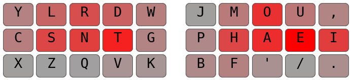

# Pine Layout

This is a keyboard layout I designed over the course of a few months, using a combination of computer generation and manual swapping. During this time, I came up with 3 different layouts, and I used each one exclusively for a few weeks to figure out which aspects of layout design were most important for comfortable and efficient typing. The following is the final layout I came up with:


## Development

The main goal of this layout is to minimize letter combinations that hinder the flow of typing. Pine focuses on sfbs, redirects, and alternation as the major detriments to speed, and so all three of these metrics are minimized.

When these metrics are minimized, other pleasant letter combinations are enhanced. This layout heavily focuses on rolls, which are both fast and intuitive to type.

The result of this uncommon pairing of high roll density and low redirection is a chord-like typing experience. Letters are often typed in pairs of two or three, but because all the vowels are on the right, long sequences typed with one hand are rare, and the layout never feels lopsided.

## Features

Here are some other nice things about the layout that weren't as important to the design, but are still nice regardless:
- Common keyboard shortcuts, such as c, v, x, z, s, are very close to their original positions.
- The left hand has very low bottom row use. This results in less finger travel because of the minimal row jumping
- The pinkies have low sfb counts and movement. The pinkies are slow and weak fingers, and are not overloaded on this layout.
- Easily alt-fingerable sfbs. I shifted the key placements within columns to make the common sfbs that do exist on this layout easy to reach with other fingers.

## Data

Here's some extra data from Semi's [analyzer](https://github.com/semilin/genkey), using quotes from MonkeyType as the corpus:

```
Pine25
y l r d w  j m o u , 
c s n t g  p h a e i ; 
x z q v k  b f ' / . 
Rolls: ~53.41%
Alternates: ~34.04%
Onehands: ~1.79%
Redirects: ~4.14%
Finger Speed (weighted): [0.36 1.03 0.76 3.54 1.96 1.29 1.01 1.42]
Finger Speed (unweighted): [0.54 3.71 3.62 19.46 10.78 6.20 3.64 2.14]
Highest Speed (weighted): 3.54 (LI)
Highest Speed (unweighted): 19.46 (LI)
Index Usage: 19.2% 13.0%
SFBs: 0.713%
DSFBs: 5.744%
Top SFBs:
	rn 0.133%	mp 0.132%	ls 0.105%	ue 0.089%
	mb 0.071%	tw 0.057%	sl 0.052%	oa 0.040%

Worst Bigrams:
	ls 14.345	wt 13.700	ue 13.272	i. 12.199
	o' 11.993	rn 11.317	mb 10.247	tg 9.915

Score: 37.12
```

And here's a heatmap:



## Glossary

- Rolls -> two consecutively typed letters on one hand and one letter typed on the other
- Alternates -> a letter typed on one hand, followed by another on the other, followed by a letter on the one hand
- Onehands -> all three letters typed on the same hand, in a continuous motion, like `sdf` on qwerty
- Redirects -> all three letters typed on the same hand, but in a disjointed motion, like 'sfd' on qwerty
- SFBs -> two consecutive letters typed with the same finger
- DSFBs -> two letters typed with the same finger separated by `n` characters, where `n > 0`
- Finger Speed -> the speed at which a finger must move 

## Contact

If you have any questions or comments, feel free to ping me on discord at ClemenPine#4679
